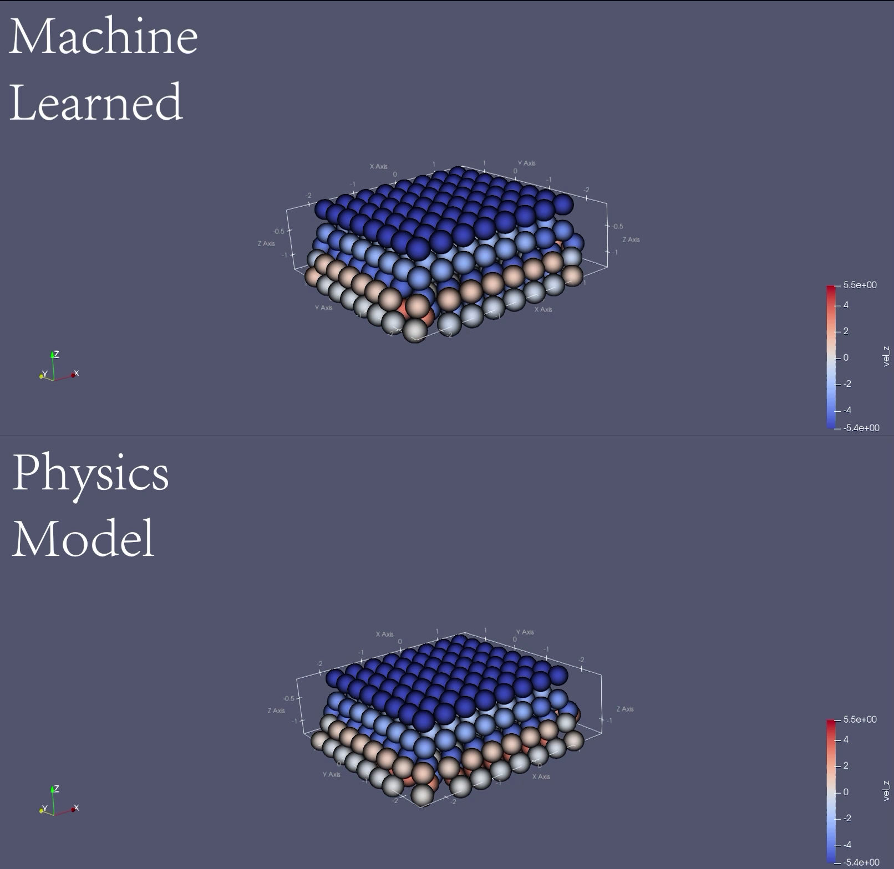
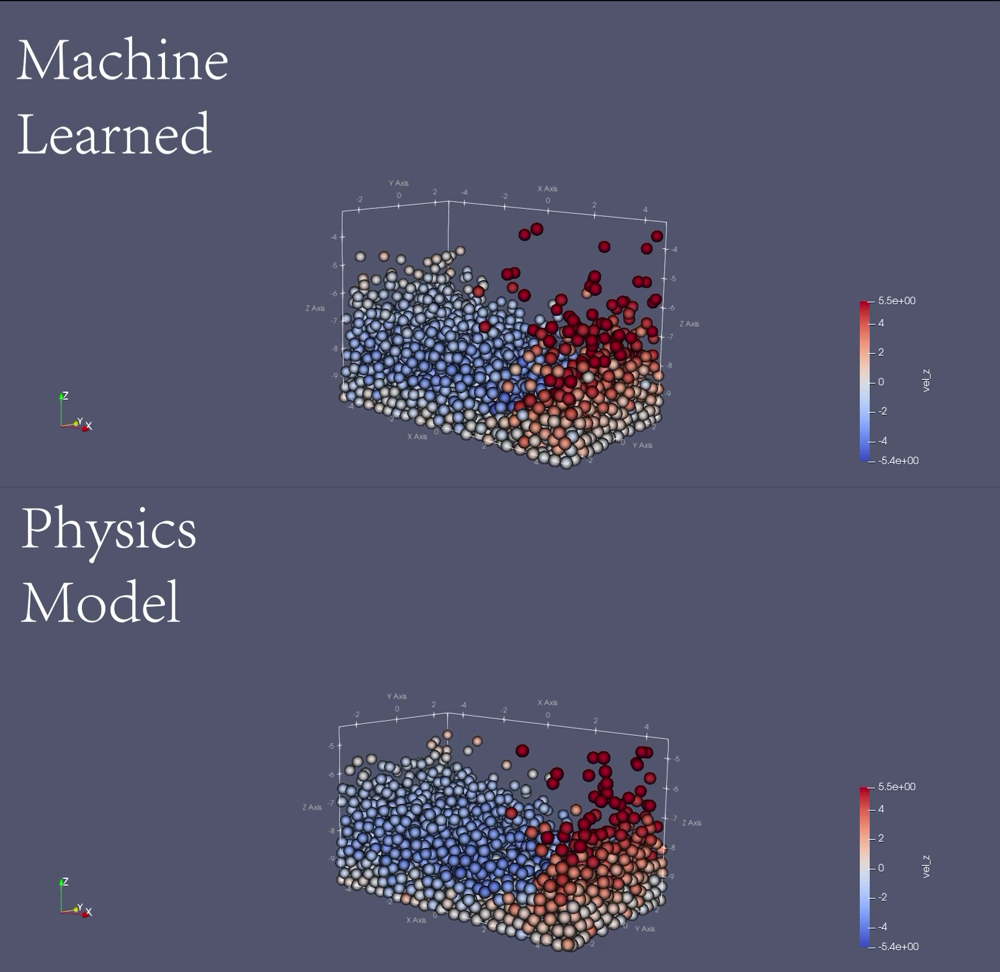

# DEM-python-testsuite

Python implementation of a preliminary DEM model, and a machine learning framework built to learn the collision and physics model of the DEM.

Full Animation:
1. https://uwmadison.box.com/s/izoxnczis6w70w53492kg811rfeu4b7x
2. https://uwmadison.box.com/s/nonvka2ha5pvr5p0ueyy1t0jfagq24mn