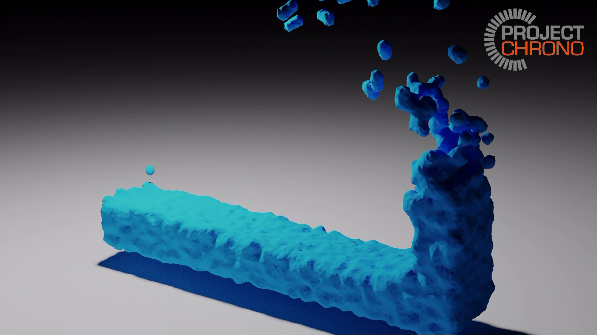

# Fluid Mesh Gneration Utility for Chrono::FSI

c++ implementation of marching cube algorithm to convert from Chrono::FSI csv output into a fluid obj mesh.

Full Animation: https://uwmadison.box.com/s/o79dr8tsu92baatzwov7p8jinsjez6t4
